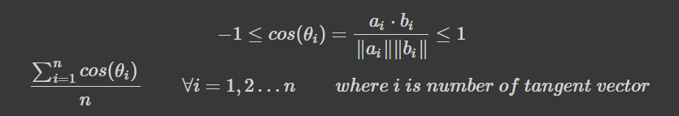
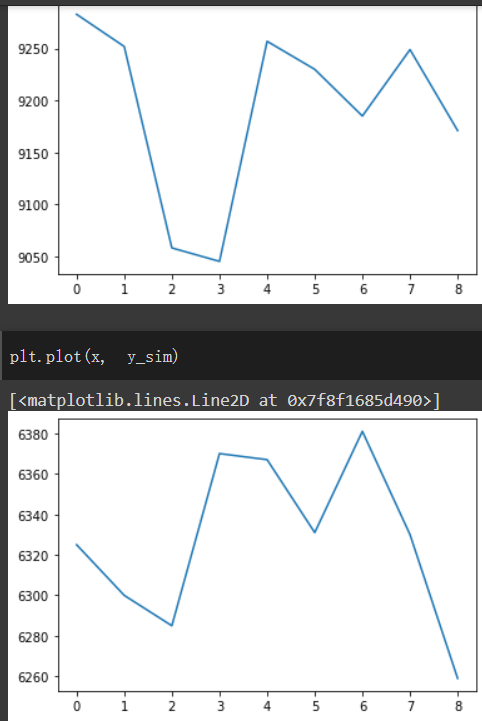

# tfx_wav

### 專案簡介 : 
建立台指期歷史資料資料庫。當未來出現像似走勢的時候，使用自定算法找出歷史最相似走勢，預測未來指數行情，作為投資參考。

### 核心算式 :

### 執行方式 :
1. 看需求是否要更新台指資料(非動態，位於data資料夾內)
2. 輸入過去9天資料來預測明日(第10天)的漲跌
3. 可調整用於計算相似度的threshold

### 算法改進方向 :
算法對方向(漲跌)最敏感，但在漲跌幅上較不敏感  &rarr; 多考慮向量長度 (norm)

### 後續更新 : 
1. 嘗試放長波段(從輸入9日資料到輸入14日資料)加上參數搜尋來檢查是否能改善準確率。[colab連結請點我](https://colab.research.google.com/drive/1Pnh8Co9Xcr4kg9SBJeJBf0q9hKtThrJk?usp=sharing)
2. 視覺化模型所找出的相似波段與輸入波段。[colab連結請點我](https://colab.research.google.com/drive/1Rx1cwmhghXJSp_0IiMDvoH2Nj0EBIm1p?usp=sharing)

### 上圖為輸入波段，下圖為自訂算法所計算出之相似波段
